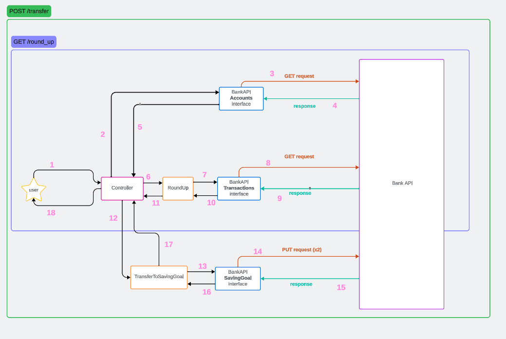

# Symmetrical System 

Rails app which uses an API to provide customers with a rounding up feature.
For a customer, the transactions are rounded up to the nearest pound and this amount is then transfered to a new saving goal.

**This was done as part of a tech test, so all identifying details have been removed.**

## Technologies

- [Ruby on Rails](https://rubyonrails.org/)
- [RSpec](https://rspec.info/)
- [HTTparty](https://github.com/jnunemaker/httparty)
- Some random bank API
- [WebMock](https://github.com/bblimke/webmock)

I used Rails to implement this app without making use of all it provides (Models, database etc).
I could have used Ruby and [Rack](https://github.com/rack/rack) to implement this instead of using Rails, however I opted for Rails as it also allows for future addition of a front-end and for the expansion into more complex operations.


## Set up

- Clone the repository

  ```
  https://github.com/m-rcd/symmetrical-system.git
  ```

- Go to the repository `symmetrical-system`

  ```
  cd symmetrical-system 
  ```

- Install dependencies
 
  ```
  bundle install
  ```

- Copy the `env.template` file and add your token:

  ```
  cp .env.template .env
  # edit the new file
  # ACCESS_TOKEN=<access_token>
  # BANK_API_URL=<bank_api_url>
  ```

Currently, it only supports one bank, however as I have an interface, adding a different bank API would be easy.
The bank api url was added as an env variable to make it anonymous. 

## Running the application


- Run the server

  ```
  rails s
  ```

- To get the round up amount and transfer the money to saving goal, run the following command in the terminal:

  ```
  curl -X POST http://localhost:3000/transfer
  ```
  
  This will  create a new saving goal and transfer the round up money to this new goal.
  The response will look like:

  ```
  {'round_up_amount':'1351','transfer_uid':'bf0f9563-4d81-4dbd-9a68-8c7f126e207d'}
  ```

 As I was only working with one account for this exercise and the transactions are all in the same period, the `account_uid` and dates (`min_date` and `max_date`) have default values if not sent in the request. 

  The default value for `account_uid` comes from a call to random Bank API using the `Accounts` interface. It will use the first one in the collection returned.
  The default value for `min_date` and `max_date` are set to `02/09/2023` and `09/09/2023` respectively.

  However, they can also be sent in the request like so: 
  
   ```
   curl -X POST http://localhost:3000/transfer \
          -d 'account_uid=<account_uid>' \
          -d 'min_date=<min_date>' \
          -d 'max_date=<max_date>' 
   ```
  
  `min_date` and `max_date` should be in the `dd/mm/year` format. 


- To get just the round up amount, without putting it into a savings goal, run the following command in the terminal:

  ```
  curl -X GET http://localhost:3000/round_up
  ```

  Response will look like: 

  ```
   {'round_up_amount':'1351'}
  ```

  Same as `transfer`, the `account_uid` and dates (`min_date` and `max_date`) have default values and can be sent in the request. 
 
   ```
   curl -X GET http://localhost:3000/round_up \
            -d 'account_uid=<account_uid>' \
            -d 'min_date=<min_date>' \
            -d 'max_date=<max_date>'
   ```


  
## Running specs

  ```
  rspec
  ```

 There are 2 layers of testing:
   - An acceptance test playing the part of the end user that tests both routes `/round_up` and `/transfer` using the real Bank API.
   - Unit testing:
      - Testing for the random Bank API interface uses `WebMock` to mock requests. 
      - Testing for the controller and operations stubs interactions with the interface. 

## Design



_`POST /transfer`  fullfills the requirements of this feature (gets the round_up amount and transfers it to a saving goal). The `GET /round_up` is an additional route that would just return the round up amount. This would be useful if we were to implement a Front End that would allow the user to see the round up amount first and click a button to start the transfer. In this case, to avoid calculating the round up twice and hitting the API multiple times, I would use a database to store it and retrieve it from there when needed._

## Approach

- I decided to have an interface to deal with the interaction with the random bank API which would allow me to test the requests in isolation and have a nice layer of separation between my logic and the random Bank API.
- The user will only interact with the controller which acts as a single point of entry and is responsible of delegating the request to the correct class. 
- As for the logic, I split it into two classes, `RoundUp` and `TransferToSavingGoal`, which each have their own responsibility.
   - `RoundUp` class which fetches the transactions for a week using `Transactions` interface, selects the out transactions and rounds up the amount to the nearest pound.
   - `TransferToSavingGoal` creates a new saving goal and then transfers the money to this new saving goal using the `SavingGoal` interface.


## Improvements

- The random Bank API interface currently has no validations for the data sent to bank API. Having them would raise an error before making an unnecessary call to bank API.
- The `RoundUp` class currently fetches the transactions, selects the out transactions then calculates the round up amount. This could be split up even further by moving the fetching of the transactions to its own class and sending those transactions into the `RoundUp` class. This would allow this class to be more general and reused if needed for any use when expanding. 